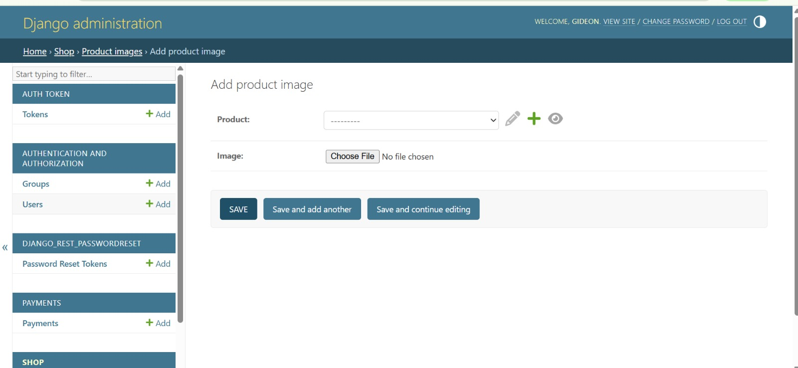
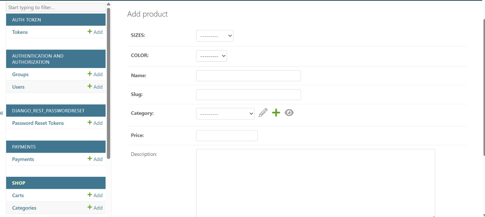
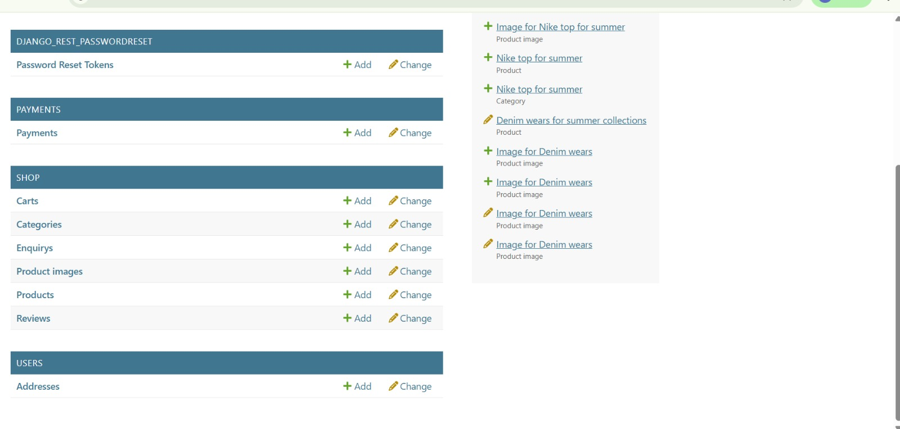
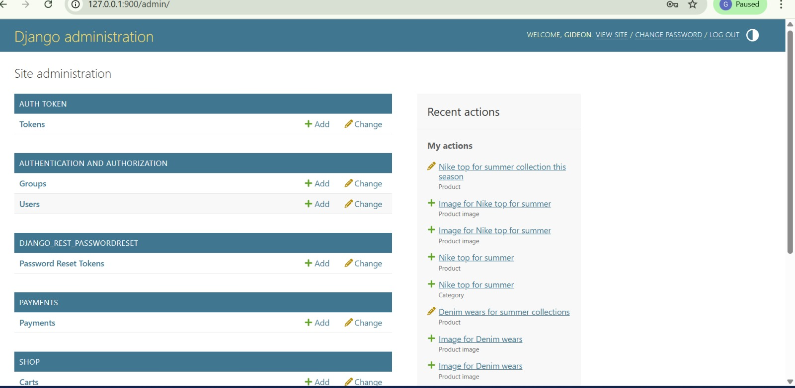

# MASCO Fashion Backend (Django API)

## 📌 Overview

This is the backend of the MASCO Fashion E-commerce application built with Django and Django REST Framework. It provides APIs for handling authentication, products, orders, and payments.

---

## 🚀 Features

- User authentication with JWT
- Product management (list, detail)
- Cart and order system
- Payment integration (Paystack)
- Admin dashboard support
- RESTful API endpoints

---

## 🛠️ Tech Stack

- Python
- Django
- Django REST Framework
- SQLite / PostgreSQL
- Paystack API

```
## 📸 Admin Panel

  
  

## 📸 Product Upload Flow

  
  
  
  

---

## ⚙️ Installation Guide

### Clone the repository

```bash
git clone https://github.com/Gideonekibade123/mascofashion

cd mascofashion
Create virtual environment (optional but recommended)
python -m venv venv
venv\Scripts\activate   # Windows
Install dependencies
pip install -r requirements.txt
Run migrations
python manage.py migrate

Start the server
python manage.py runserver
🔗 API Base URL
https://mascofashion.onrender.com/
📂 Project Structure
backend/ → Django project files
api/ → Main application (views, models, serializers)
manage.py → Django entry point
🔐 Authentication
Uses JWT (JSON Web Tokens)
Login to receive access token
Include token in headers:
Authorization: Bearer <your_token>

💳 Payment Integration
Integrated with Paystack for secure payments
⚠️ Note

This backend is deployed on Render and may go to sleep due to free-tier limitations.

🧠 What I Learned
Building REST APIs with Django
Handling authentication with JWT
Connecting frontend (React) to backend
Deploying backend with Render
